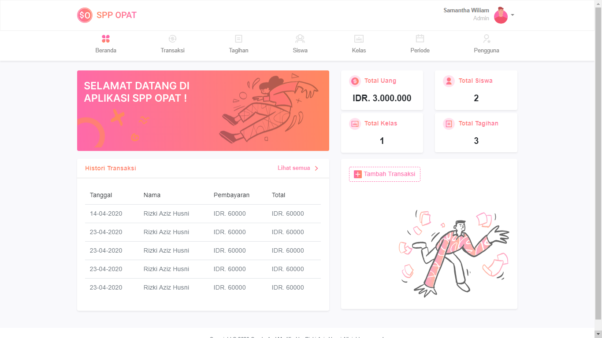

## SPP-OPAT
## Tentang SPP-OPAT
SPP-OPAT adalah sebuah aplikasi untuk mempermudah sebuah sekolah dalam mendata pembayaran SPP para siswa/siswinya, dengan menggunakan aplikasi ini tentunya akan lebih mengurangi biaya dalam pendataan pembayaran SPP.

Aplikasi ini memiliki 3 hak akses

Level Admin
- Login
- Logout
- CRUD data siswa
- CRUD data petugas
- CRUD data kelas
- CRUD data SPP
- Entri Transaksi Pembayaran
- Lihat Histori Pembayaran
- Generate Laporan

Level Petugas
- Login
- Logout
- Entri Transaksi Pembayaran
- Lihat Histori Pembayaran

Level Siswa
- Login
- Logout
- Lihat Histori Pembayaran

## Cara Install
$ git clone https://github.com/pembayaran-spp.git 
$ cd SPP-OPAT 
$ composer update 
$ php artisan migrate --seed 
$ php artisan serve

Catatan : buat database dengan nama db_spp sebelum melakukan migrate.

## Akun untuk Login
Level Admin
- email : admin@opat.id
- password : admin123

Level Petugas
- email : petugas@opat.id
- password : petugas123

Level Siswa
- Harus dibuat oleh admin

## Basic
- Routing https://laravel.com/docs/5.8/routing
- Middleware https://laravel.com/docs/5.8/middleware
- Controller https://laravel.com/docs/5.8/controllers
- CSRF protection https://laravel.com/docs/5.8/csrf
- Request https://laravel.com/docs/5.8/requests
- Views ttps://laravel.com/docs/5.8/views
- Session https://laravel.com/docs/5.8/session
- Validation https://laravel.com/docs/5.8/validation

## FrontEnd
- Blade Templates https://laravel.com/docs/5.8/blade

## Framework FrontEnd
- Bootstrap 4 https://getbootstrap.com/
- Animate On Scroll Library https://michalsnik.github.io/aos/

## Security
- Authentication https://laravel.com/docs/5.8/authentication
- Hashing https://laravel.com/docs/5.8/hashing

## Databases
- Query Builder https://laravel.com/docs/5.8/querie
- Migrations https://laravel.com/docs/5.8/migrations
- Seeder https://laravel.com/docs/5.8/seeding
